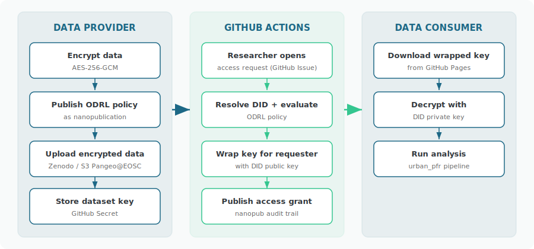

# FAIR2Adapt Data Access

This service manages access to private FAIR2Adapt datasets using **ODRL** policies published as **nanopublications**, with data encrypted via **AES-256-GCM** and identity verified through **DIDs** (Decentralized Identifiers).

:::{note}
This tool is designed for data that is **private but not sensitive** — data that can be shared under specific conditions (e.g., academic research only) but should not be openly published.
:::

## How it works

## Quick start

::::{grid} 1 1 3 3

:::{card} Try the walkthrough
:link: https://fair2adapt.github.io/fair-data-access/walkthrough/

**Reproducible Walkthrough** — End-to-end example with synthetic data: encrypt, publish ODRL policy, wrap key, decrypt. Runs in 15 minutes.
:::

:::{card} I have data to share
:link: tutorial-provider.md

**Data Provider Tutorial** — Encrypt your data, create ODRL policies, and set up automated access control.
:::

:::{card} I want to access data
:link: tutorial-consumer.md

**Data Consumer Tutorial** — Set up a DID, request access, and decrypt data for your analysis.
:::
::::

## Available datasets

| Dataset | Description | Policy |
|---------|-------------|--------|
| `hamburg-buildings` | Building footprints with demographic indicators | Academic research only |
| `hamburg-statistical-units` | Statistical units with social vulnerability indicators | Academic research only |
| `hamburg-risk-private` | Building-level pluvial flood risk outputs (PFRMA, PFRWB) | Academic research only |

## Components

| Component | Where | Purpose |
|-----------|-------|---------|
| ODRL policies | Nanopub network | Access terms (immutable, signed) |
| Access grants | Nanopub network | Audit trail (immutable, signed) |
| Encrypted data | Zenodo / S3 Pangeo@EOSC | Storage (publicly downloadable, encrypted) |
| Key server | GitHub Pages + Actions | Key distribution + policy enforcement |
| Pipeline code | [urban_pfr_toolbox_hamburg](https://github.com/FAIR2Adapt/urban_pfr_toolbox_hamburg) | Flood risk processing |

## Links

- [Reproducible walkthrough](https://fair2adapt.github.io/fair-data-access/walkthrough/) — end-to-end ODRL access control with synthetic data
- [Source code](https://github.com/FAIR2Adapt/fair-data-access)
- [Flood risk toolbox](https://github.com/FAIR2Adapt/urban_pfr_toolbox_hamburg)
- [FAIR2Adapt project](https://fair2adapt-eosc.eu)
- [Science Live platform](https://platform.sciencelive4all.org) — user-friendly nanopub creation and viewing
- [ODRL specification](https://www.w3.org/TR/odrl-model/)
- [Nanopublications](https://nanopub.net/)
